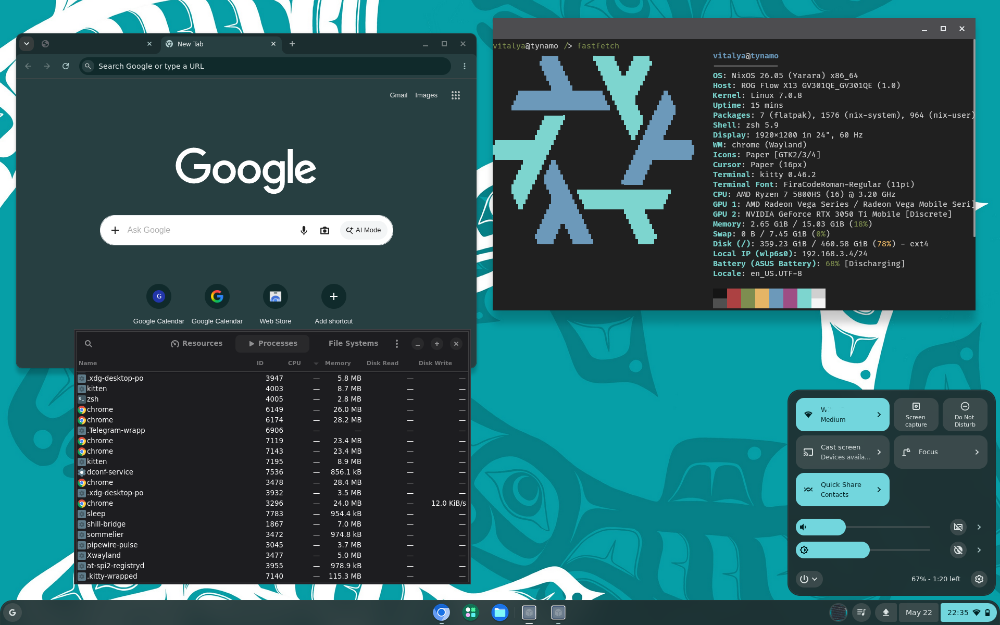

# chromeos-linux

**ChromeOS Ash shell. On NixOS. It's bad.**



This repo takes a prebuilt ChromiumOS Chrome binary, puts it in front of X11, and teaches regular Linux to answer the ChromeOS D-Bus APIs Ash expects.

The result: the Ash desktop shell — system tray, app launcher, shelf, Terminal
SWA, the works — running as your Linux desktop.

## How it works

```
Ash binary (prebuilt ChromiumOS Chrome)
    │
    └── D-Bus (system bus)
          ├── org.chromium.flimflam     ←→  [shill-bridge]      →  NetworkManager
          ├── org.chromium.cras         ←→  [cras-bridge]       →  PipeWire/PulseAudio
          ├── org.chromium.PowerManager ←→  [power-bridge]      →  UPower
          └── org.chromium.SessionManager ←→ [session-bridge]
               └── + org.chromium.UserDataAuth   (compat)
```

Each bridge is a small Go daemon that:
1. Owns a ChromeOS D-Bus service name on the system bus
2. Translates Ash's calls to the equivalent Linux API
3. Forwards signals back (network changes, battery level, volume)

## Quick start

```bash
nix build --impure .#ash-vm            # full VM image
./result/bin/run-nixos-vm
```

To run as a NixOS desktop, add the module to your flake:

```nix
{
  inputs = {
    nixpkgs.url = "github:NixOS/nixpkgs/nixos-unstable";
    ash.url = "github:vitalyavolyn/chromeos-linux";
  };
  outputs = { nixpkgs, ash, ... }: {
    nixosConfigurations.my-machine = nixpkgs.lib.nixosSystem {
      system = "x86_64-linux";
      modules = [
        ash.nixosModules.default
        ({ pkgs, ... }: {
          services.chromeos-linux = {
            enable = true;
            user = "vitalya" # replace with your username
          };
        })
      ];
    };
  };
}
```

## What works

The desktop comes up and is usable as a very strange Linux shell:

- Ash boots into a persistent ChromeOS-style desktop with OOBE skipped.
- The shelf, launcher, quick settings, and system tray open.
- All 24 System Web Apps install, including Terminal, Files, Settings, and Camera.
- The Terminal SWA starts a real bash shell through the injected terminal UI.
- Chrome survives login/session re-execs instead of falling out of the display manager.
- The bridge daemons run for shill, CRAS, powerd, session_manager, UserDataAuth, Crostini, rmad, and Mojo service manager compatibility.
- NetworkManager feeds the shill bridge with real ethernet state.
- PipeWire/PulseAudio volume control works through the CRAS bridge.
- UPower feeds battery state into the power bridge.
- Screen brightness works through sysfs with an xrandr fallback.
- Linux desktop plumbing works: file pickers, xdg-desktop-portal-gtk, polkit prompts, and gnome-keyring.

## Rough Edges

These work enough to be useful, but they are not Chromebook-grade:

| Area | State |
|------|-------|
| Network/audio/battery tray data | Real bridge data exists, but very limited. |
| Linux app launcher integration | `.desktop` files are written into Crostini prefs, but they may not launch (most do, though.) |
| Terminal emulation | Basic shell speaks just enough VT100 to render fastfetch. Just use your linux terminal app. |
| Audio devices | Volume works, but CRAS nodes are hardcoded Speaker/Headphone/Mic entries rather than real PipeWire node discovery. |
| Managed Linux app rendering | X11 apps on DISPLAY=:0 get hardware Vulkan. Wayland-managed app windows use the wl_shm path. |

## What Doesn't Work Yet

- WiFi network selection, connect, and disconnect from the ChromeOS UI.
  - Actually, most settings.
- Suspend.
- Lock screen integration.
- Notifications through Ash's notification center.
- StatusNotifierItem tray icons.
- Google account login, sync, Phone Hub, Nearby Share, or other account-bound ChromeOS services.

## We're ChromeOS now

`CHROMEOS_RELEASE_NAME=Chrome OS` in `/etc/lsb-release` flips Ash from built-in
fallback clients to real D-Bus ones — but also enables ChromeOS Mojo IPC mode, which
requires a `/run/mojo/service_manager.sock` peer. Our `mojo-stub` does the
ACCEPT_INVITEE handshake and drains messages, but it's basic.

## Binary patches (applied at build time)

The Chrome binary gets a few small patches:
- **Terminal stub**: replaces `chrome.terminalPrivate.openVmshellProcess(...)` with `eval(localStorage.t||"")` so we can inject a terminal implementation.
- **CSP relaxation**: `'wasm-unsafe-eval'` → `'unsafe-eval'` so the Terminal page can eval injected JS
- **DisplayConfigurator**: skip native display config on X11 (no native display delegate = crash)
- **WaylandDmabufFeedbackManager**: version=0 to skip dmabuf capability probing
- **HasInternalDisplay**: always returns true (enables brightness slider)
- **OnDisconnect**: no-op (prevents crash when mojo pipe times out)
- **crashpad handler wrapper**: always supplies `--database` arg (fixes a crash)

All patches fail loudly if the binary changes.

## References

- [ChromeOS D-Bus system_api](https://chromium.googlesource.com/chromiumos/platform2/+/HEAD/system_api/dbus/)
- [Ash D-Bus client source](https://source.chromium.org/chromiumos/chromiumos/codesearch/+/main:src/chromeos/ash/components/dbus/)
- [chromeos-session reference](https://github.com/0xbaaaadf8/chromeos-session)
